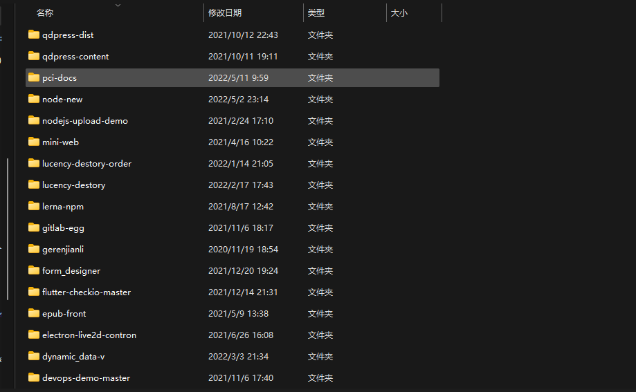
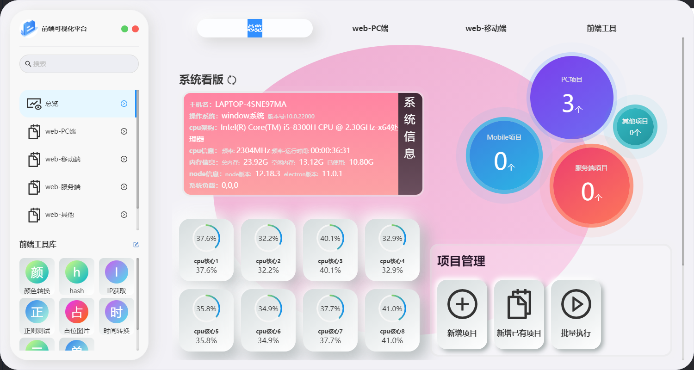

# 简述

## 开发起因

​	随着前端项目的开发,前端项目就会越来越多,比如小程序,pc端,移动端h5项目已经微前端的项目,公司的还有自己的,那么每次打开自己项目文件夹就会出现以下情况:



> 如上图所示,就会存在一下问题:
>
> - 项目数量庞大,项目查找较麻烦
> - 项目启动繁琐,需要频繁切换到对应文件下进行运行
> - 无法快捷找到对应文件夹进行指令执行
> - 无法快速进行多个项目启动

​	所以,我就想着能否开发出一个能够方便自己的开发工具,期望能做到以下功能

> - 能够动态获取项目指令并批量执行
> - 能够动态管控和查询对应项目
> - 能够快捷打开项目和对应文件夹路径
> - 文件打包完成后将打包文件放入指定文件下
> - 最好能够支持浏览器插件进行对应功能调用

## 技术选型

​	由于项目启动和打包都是基于node环境,所以我最先选择的是node.js进行全局包工具开发([xl-order](https://www.npmjs.com/package/xl-order)),设想为将多个指令保存并在调用时进行批量执行,比如我可以将

```bash
nginx -c /etc/nginx/nginx.conf && nginx -s reload
```

 视为一个指令并为其规定一个调用别称,这样我可以通过调用别称直接进行对应代码的执行,减少每次都需要重复输入大量代码.

> **优点:**
>
> - 解决了每次都需要进入对应项目的痛点
> - 解决了多个指令执行时需要本人时常关注执行的问题
> - 部分解决了快捷启动对应项目等
>
> **缺点:**
>
> - 每次执行都需要打开一个cmd
> - 非可视化界面,交互局限较大
> - 无法快捷打开对应文件夹
> - 无法提供一些开发小工具等
>
> **结论:**
>
> ​	该工具较适合在服务器环境上进行操作,可对执行指令进行压缩,不需要多次输入冗余指令,如果大家觉得有兴趣可使用[xl-order](https://www.npmjs.com/package/xl-order),源码后续优化后就会放出

​	随着node插件开完告一段落,我发现这个工具虽然能用,但局限还是太大

达不到我心里的预期,且页达不到浏览器插件调用功能的预期,所以我将目光看向了electron,electron提供了node环境+系统文件等功能+浏览器环境的功能,那么,以上的问题理论上就可以通过electron解决,而且浏览器插件调用本地功能也成为可能,原因是node本身是可以启动一个**服务器端口**,那么其他软件如果需要调用功能,只需调用对应接口即可.

​	说干就干,随着我几个月的奋斗,**前端可视化平台(WEBPCILVDS)**,和对应**浏览器插件**完成了第一版开发

## 软件功能简述

​	本软件提供可视化管理前端项目,提供指定执行项目指令执行额外执行指定逻辑,提供浏览器插件,支持通过浏览器插件进行软件项目管理模块的调用



并提供一些前端实用小工具,方便开发

## 个人说明

​		该工具的开发本意就是方便自己已经工作时候使用,如果有大佬们有不同意见,也可提issue给小弟,会一一回复的哈~(项目代码优化后,会进行开源)