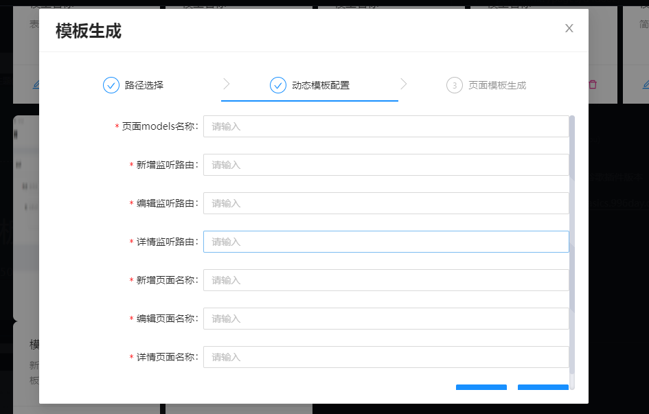

# 实验性功能-模板生成器

## 设计思路

​	开发这个功能,主要是考虑到前端编写后台界面时,在很多基础页面上都在重复的搭建,比较耗时耗力,虽然可以把抽离封装一个模板,但是每次使用时还需手动的更改一个页面的基础配置,较为麻烦.

## 开发思路

	1. 手动将一些常用的页面封装成模板,
 	2. 然后在模板里面生成一个动态的配置表单文件,
 	3. 每次需要使用时,就可以通过软件端动态选择生成的路径,
 	4. 然后再去读取模板下的配置表单
 	5. 填写读取出来的表单数据
 	6. 将模板文件复制一份到对应路径下
 	7. 将填写完成的数据放入模板的config文件夹下
 	8. 完成

## 开发问题

### 动态配置表单文件

​	不同模板需要的表单是不一样的,如果还是采用静态写的话,就会存在无法测试,且无法动态添加,相关并不理想,所以,采用[实验性功能-模板生成器](/pages/c93b8b/)来进行对应表单的动态配置以及文件生成

## 文件读取解析的问题

​	软件读取文件,并不能简单像require或者import这样引入,因为模板文件本质上属于绝对路径的引入,是不合规范的,所以目前采用的方法为直接读取出静态字符串,然后通过解析获取想要的参数

## 文件的复制和修改

​	通过nodejs模块的支撑,可以直接将文件复制过去,存在同名即直接进行覆盖

完成后,就把填写的动态输入放入对应路径下

## 进度

开发已完成,内测进行中~