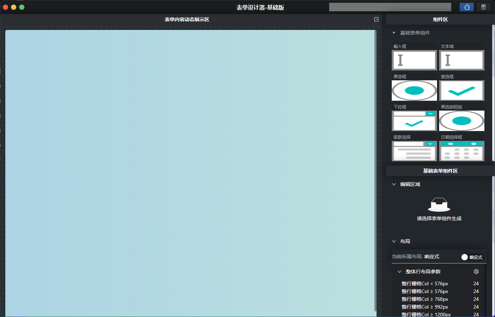
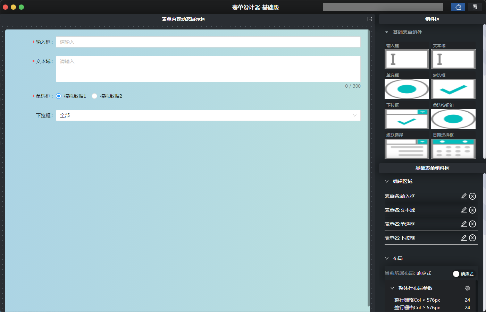
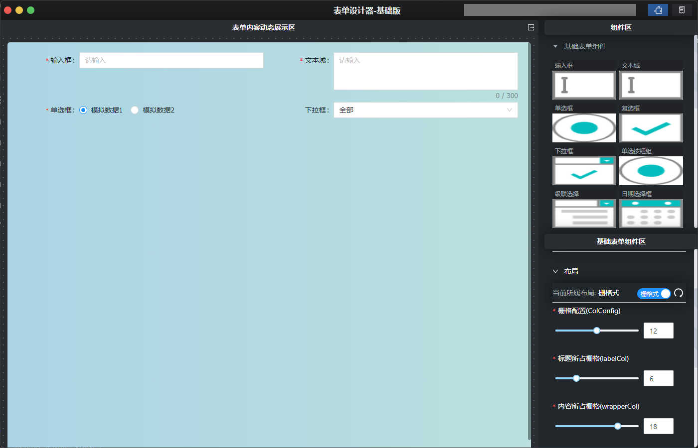
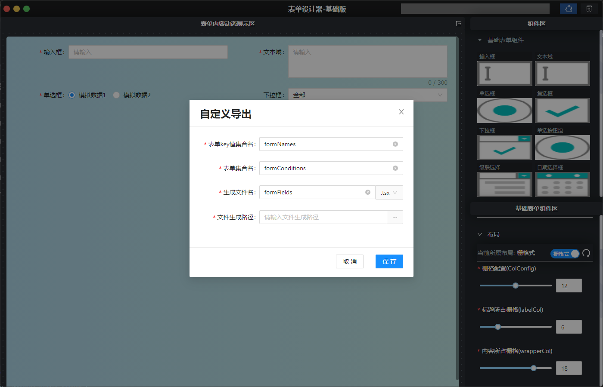

# 实验性功能-表单设计器

## 设计思路

​	每次开发,遇到的最多的就是各种各样的表单,虽然逻辑不一样,但是抽离个性,总结共性,每次表单都是由一个最简单的表单不断嵌入逻辑,最终形成,那么?是否可以把最简单的表单通过可视化软件直接进行生成文件,然后在进行逻辑嵌入呢

## 开发思路

1. 右边放入常用的表单组件和动态栅格配置
2. 鼠标进行点击新增和拖拽
3. 动态配置栅格数据
4. 根据导出表单填写的内容进行对应文件导出

## 进度

开发已完成,内测进行中~