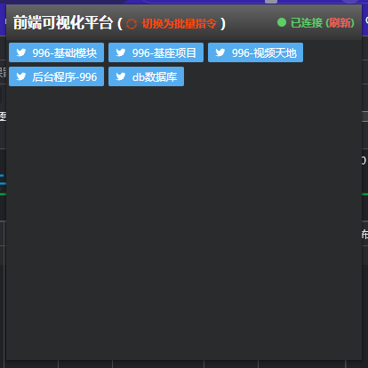
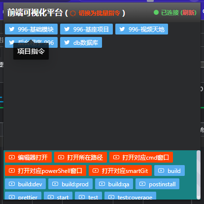
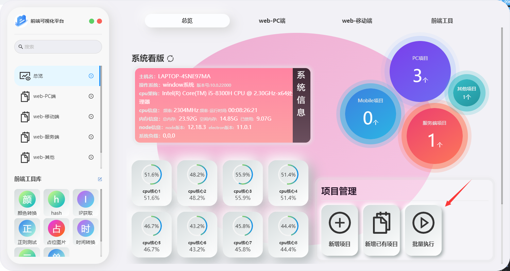

# 浏览器插件-介绍

## 界面

## 设计思路

​	electron框架提供了node模块,node本身是可以作为一个服务端存在于后台,那么其他软件是否可以通过调用本地的模块的接口,进行通知软件端进行软件调用呢,事实是可行的

## 功能介绍

​	谷歌插件出发点主要是用于快捷调用已有的功能,且插件本身进行数据添加所需要的功能比较复杂,所以第一版的设计就是通过浏览器插件进行对应项目的指令或者已经创建好的批量指令进行快捷调用,达到尽可能减少多余的点击量

### 项目指令启动

1. 点击选中对应的项目,插件会通知软件端去读取对应项目的package.json

   然后返回到插件,进行展示,效果如下图

   

   2.点击下方对应按钮即可完成对应功能的调用

   > 注意:
   >
   > ​	橙色按钮为额外添加功能,非项目自带的指令,如果没有对应的软件或者环境,可能为无效调用
   >
   > ​	蓝色按钮则为项目package里的script的指令,点击对应按钮,则会进行对应指令的快捷调用

## 批量指令

​	这个功能主要用于同时执行多个项目的指令或者执行多个功能,功能配置入口在软件首页的

插件只会读取到已经配置完成的指令,然后展示提供调用,点击对应指令即可完成调用

## 下载

[请前往](https://basics.996day.com/webPciDownload)