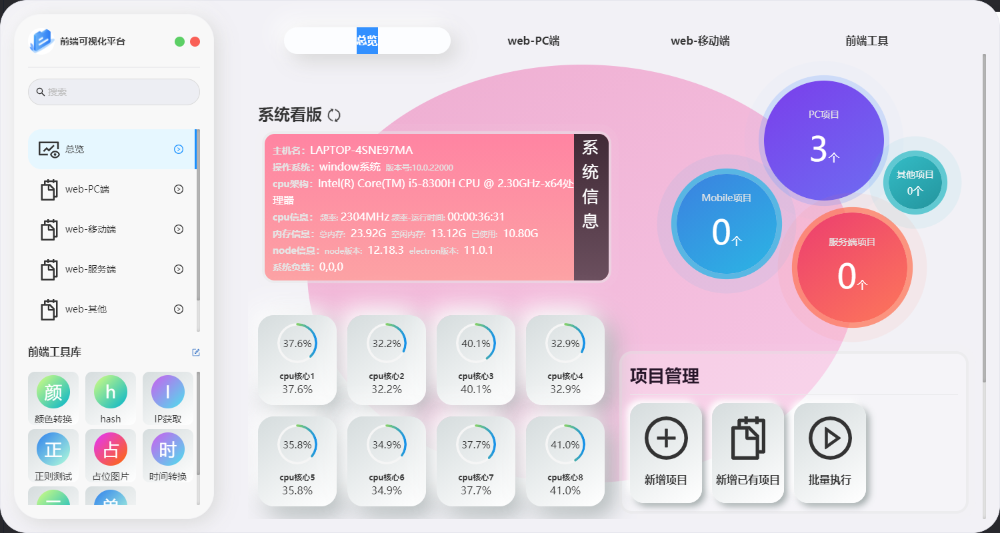
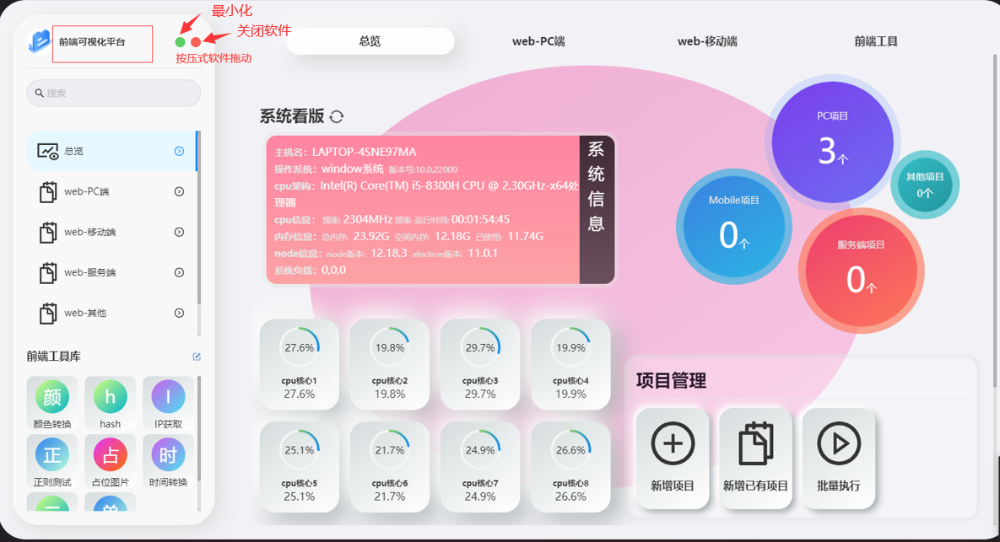

# 软件介绍

## 软件全貌

### 系统看板

​		提供系统配置面板,快捷查看当前电脑的配置和对应node版本,和cpu运行状态,并支持快捷查看当前电脑的对应网关配置

### 项目管理

​		目前支持新增项目,新增已有项目,已经配置和执行多个项目的批量指令执行功能,以及上方的项目数量可视化展示,可通过左侧和顶部快捷栏进行对应页面跳转进入

## 软件基础操作

​		本软件采用的是隐式项目拖动,鼠标移入前端可视化文字上,按下即可实现软件拖动,下图所示

## 浏览器插件

​		提供快捷调用对应项目指令和快捷调用批量执行指令,如需使用,请[点击下载](/pages/d4d802/)