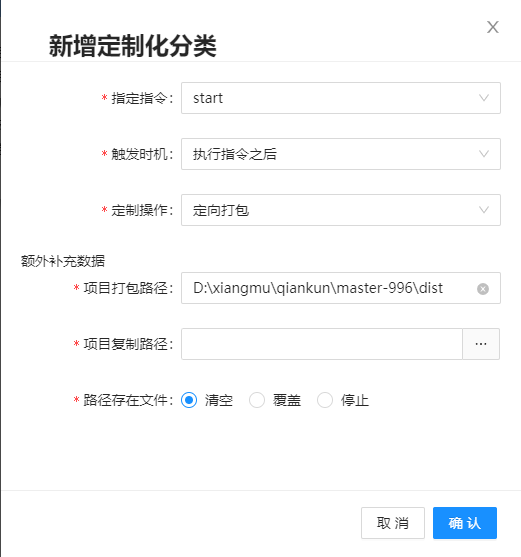

# 项目管理-定制化说明

​	定制化需求是笔者在接入微前端时候的一个想法,由于项目拆分较多,每个项目都是对应的单个项目,如果打包后的文件是需要存放到一个统一的文件夹下面进行统一管理,那么**每次打完包,就需要手动ctrl C+V**,偶尔几次还好每次都这样,就有点烦了,所以就产生了在每次执行项目执行的前后进行

​	当然,由于当前软件尚处于刚起步状态,所支持的定制化较少,后续会增加,以下会介绍已有的几个定制化操作

## 执行指令之前-拉取最新代码

​	原理很简单,就是在执行配置的项目指令之前,git pull 当前分支的代码 拉取完成后就进行对应代码的执行

## 执行指令之前-自定义代码执行

​	即在执行项目指令之前,先执行自定义的指令,如果是多个指令,可以用 && 隔开即可

## 执行指令之后-定向打包

​	选择该指令后会额外填写几个配置项

在项目执行执行完成后就会进入对应逻辑执行,手动介绍并不会进入

## 后续定制化指令思考中~