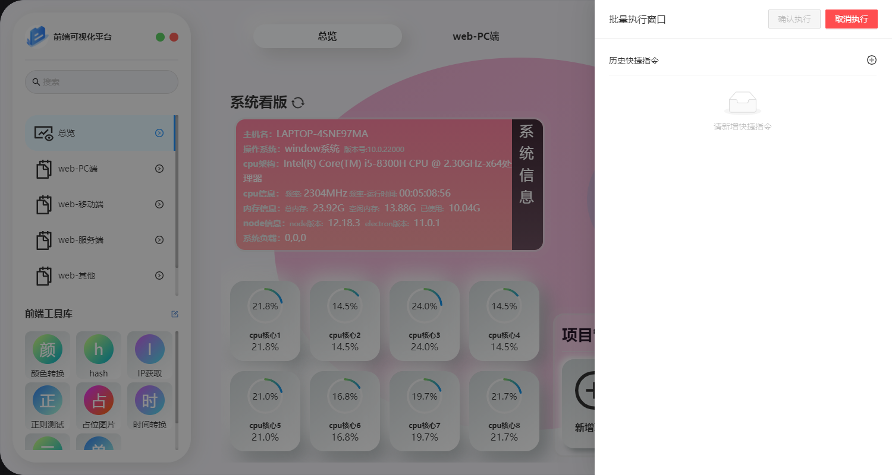
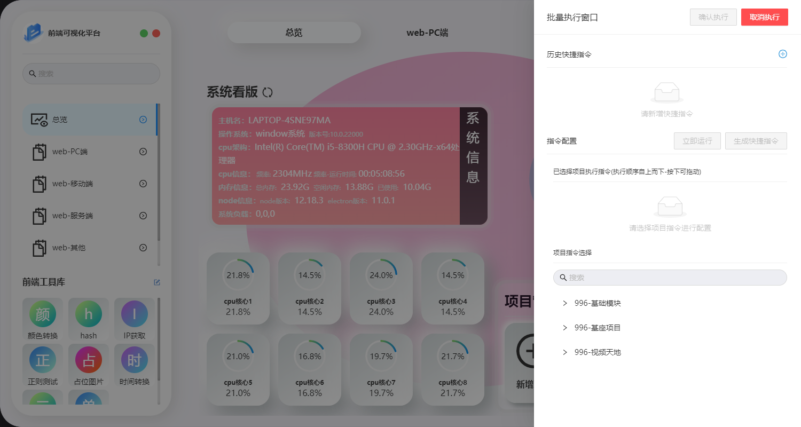
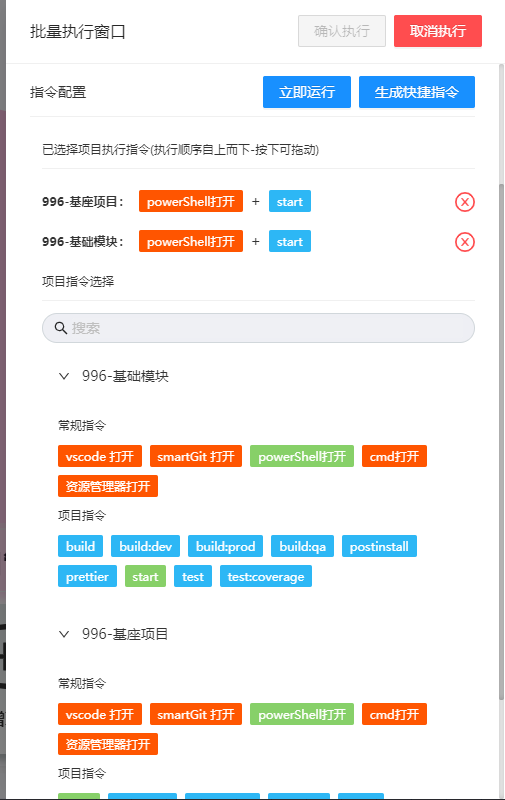
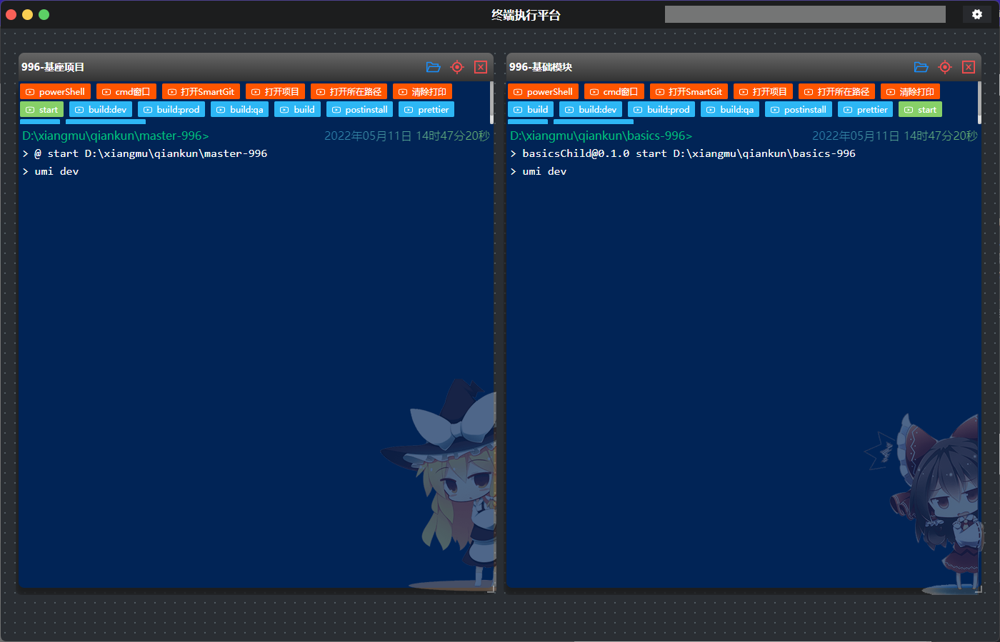

# 软件操作-批量执行

​	这个功能灵感来自于之前笔者开发的中台系统随着开发,项目体积愈加庞大,每次编译和打包耗时非常大,且代码合并有可能会波及其他中心代码,所以就进行了微前端升级,然后项目总数由1个拆分出了十几个项目,但是随着项目拆分,虽然编译和打包速度都下降了,但是每次都要单独进入一个项目文件夹打包,确实也耗时耗力,且用该软件的单个项目进行打包,也需要点击很多次,虽然每次打完包会自动放入指定的路径文件夹下,所以我就想开发出一个能同时同步执行多个项目指令

## 初始化界面

​	第一次进入,是不存在已配置的批量执行指令的 如下图

## 新增批量执行指令

本系统会获取当前已配置的所有系统,每个系统都**支持常规指令+项目指令同步执行**,**且支持多个项目同时配置启动**,如:

### 立即运行

​	点击立即运行会立即执行当前配置的对应项目指令,但不会保存,关闭后无法找回

### 生成快捷指令

​	配置完成后既可进行保存到本地数据中,方便浏览器插件和后续调用

