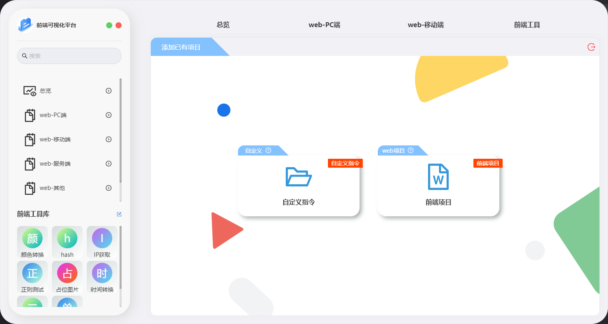
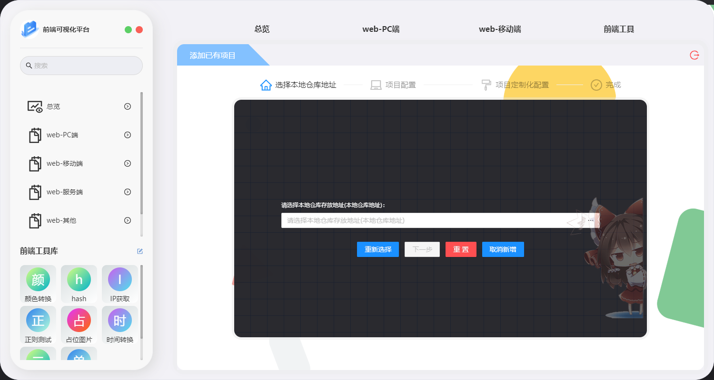
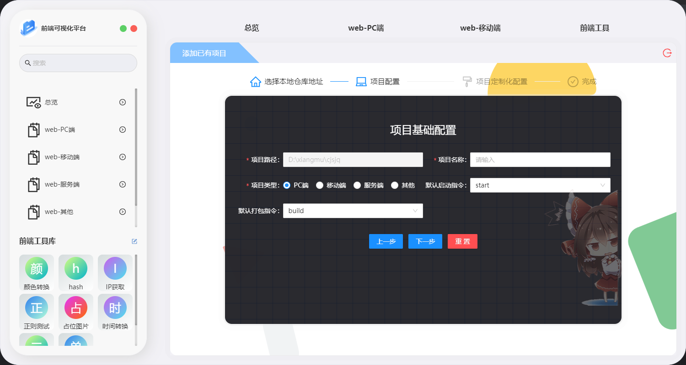
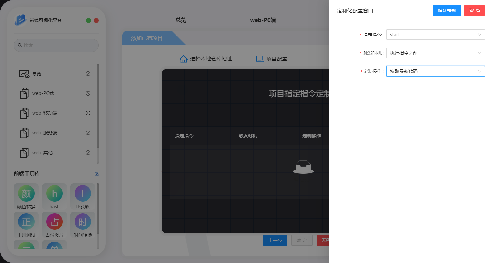
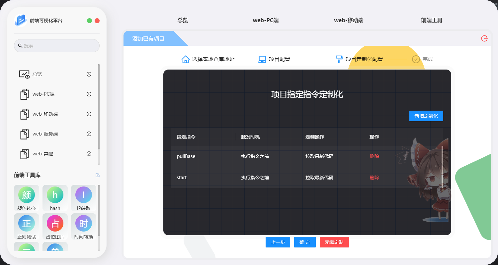

# 软件操作-新增本地项目

​	新增本地项目分为2种,一种为自定义指令,非前端项目,一种为本地以及存在的前端项目新增

## 自定义指令

​	该自定义指令主要用于部分非前端项目,对部分非前端项目进行对应快捷指令的调用,比如进入对应文件夹运行 start nginx操作等

​    该自定义指令主要用于兼容执行一些非前端项目

## 前端项目

​	主要用于添加当前以及拉取到本地的前端项目

### 第一步-选择本地的前端仓库地址

请选择到项目的根目录路径.即项目的package.json所在的路径文件夹下

### 第二步-项目基础配置

关于指令,软件会自动获取package.json的数据

## 第三步-项目指定指令配置化

 该功能,主要用于在指定对应项目命令前,进行一些定制化的操作,例如执行项目启动前进行代码拉取等操作,对应定制化操作请查看[已有指令定制化](/pages/ef5c20/),这里仅做项目配置介绍.(**如果不需要配置,可点击无需配置即可**)

 目前仅支持单个指令,只可以配置一条,可选择指令的执行契机,且所执行的操作,比如以下示例

单个指令可配置一条定制化

综上,就是新增远程本地仓库的内容