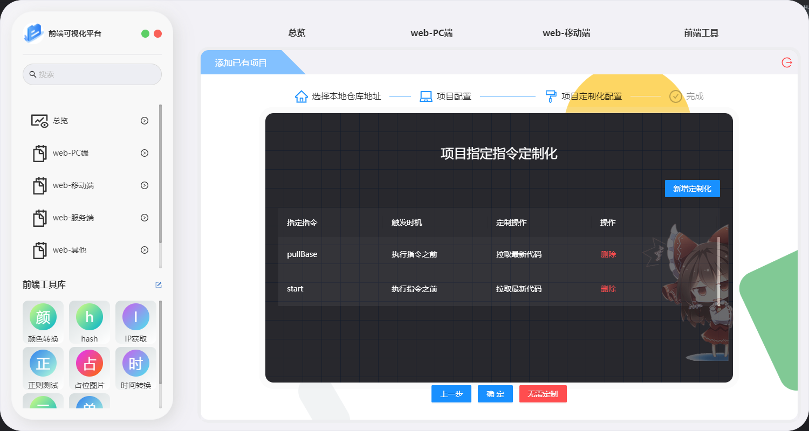

# 软件操作-新增项目

## 说明

### 第一步-项目拉取

 本软件设计为新增已有项目和新增远程仓库的项目,本文介绍的是新增远程仓库项目

> 首先输入远程仓库地址,然后选择本地的仓库的存储路径,输入完成点击拉取,软件会自动进入配置的本地仓库存储路径下进行 git clone,(**请保证具有仓库的拉取权限**)

第一步操作完成如下图

### 第二步-项目基础信息配置

 项目已经拉取到本地,本软件会默认读取项目根目录下的**package.json**,和 git 分支情况,提供对应的配置项,支持第一次初始化时默认进行**分支切换**.以及默认指令的记忆,如下图

当把上图所填写的内容填写完成后,点击下一步,就会开始默认**安装依赖包**,并打开安装进度弹框,如下图,

**注:** 安装依赖包,正常项目来说安装时间会非常漫长 所以推荐点击后台运行即可,安装完成会有通知提示,

## 第三步-项目指定指令配置化

 该功能,主要用于在指定对应项目命令前,进行一些定制化的操作,例如执行项目启动前进行代码拉取等操作,对应定制化操作请查看[已有指令定制化](/pages/ef5c20/),这里仅做项目配置介绍.(**如果不需要配置,可点击无需配置即可**)

 目前仅支持单个指令,只可以配置一条,可选择指令的执行契机,且所执行的操作,比如以下示例

单个指令可配置一条定制化

综上,就是新增远程仓库的内容
