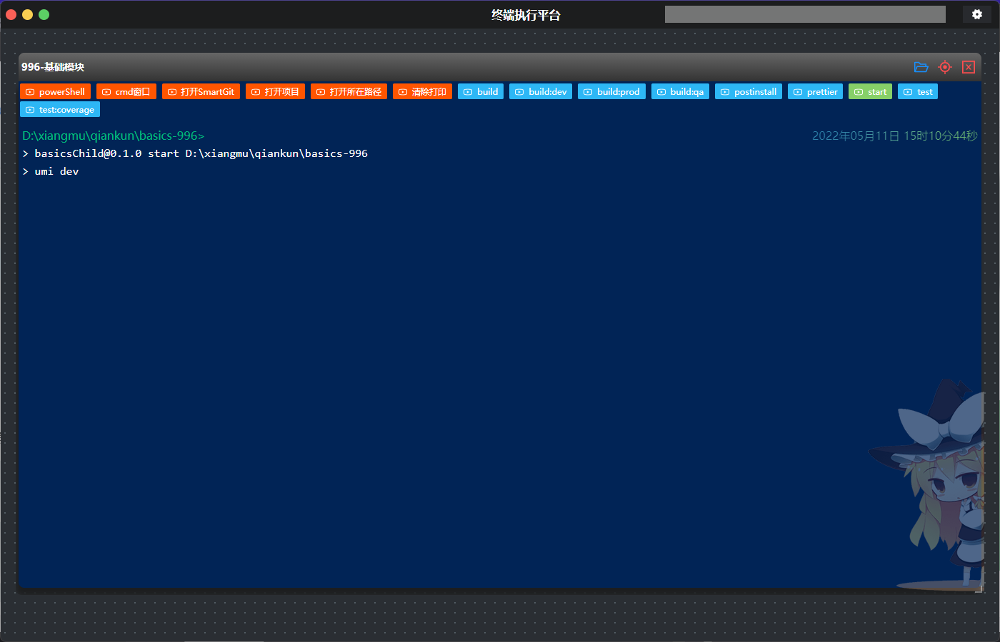
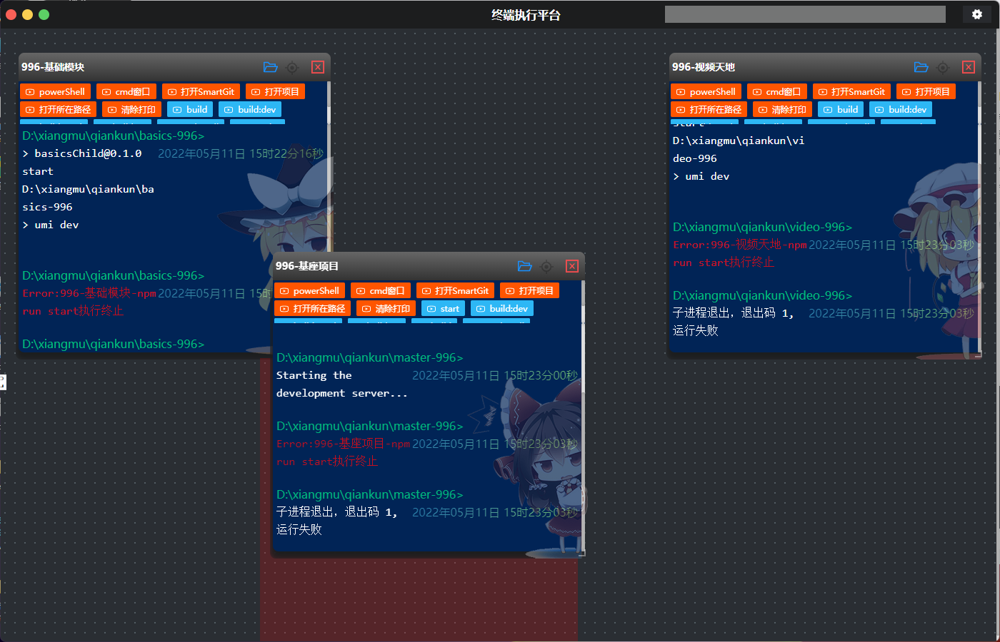
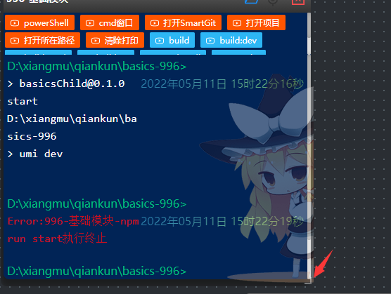

# 软件操作-运行介绍

​	指令执行界面如下

项目常规指令说明

| 常规指令       | 说明                                            |
| -------------- | ----------------------------------------------- |
| 打开项目       | 软件会进入项目根目录执行code . 打开vscode       |
| smartGit打开   | 软件会进入项目根目录执行smartGit . 打开smartGit |
| powerShell打开 | 软件在项目根目录打开新的powerShell提供给使用    |
| cmd            | 软件在项目根目录打开新的cmd提供给使用           |
| 打开所在路径   | 软件会在文件管理器中打开对应项目                |
| 清除打印       | 会清空目前已打印的数据                          |

项目指令说明

​	软件会读取package.json下的script内容,然后展示在项目指令下,点击即可进行指令执行,当已经运行了指令的情况下点击其他指令会强制终止当前已执行的指令,从而切换到对应指令,并先判断是否有定制逻辑

## 拖动布局

鼠标按下即可实现拖动排序,

拖动这里即可完成放大缩小布局

## 注意事项

​	关闭当前项目执行框时,请先停止项目的运行,否则很小的可能会出现内存泄漏,请知悉