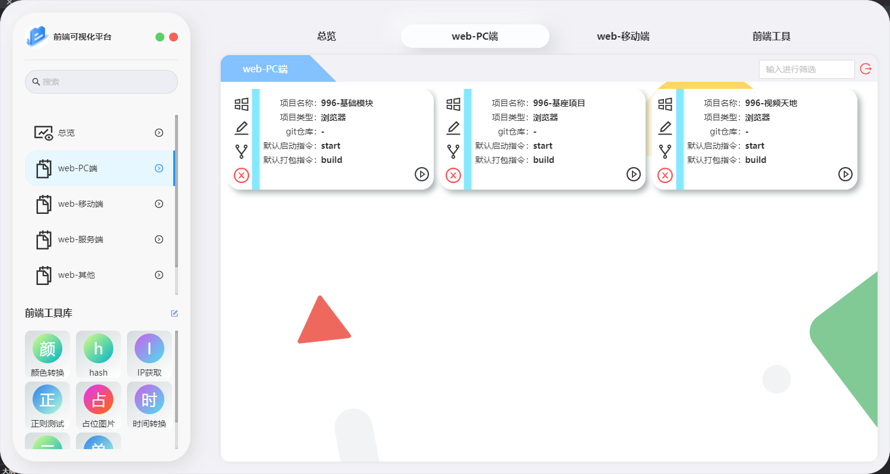
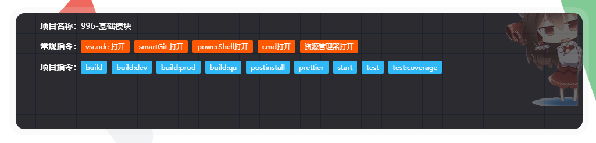

# 软件操作-项目运行

​	本文主要介绍单个项目进行启动,vscode打开,或文件管理器打开,或直接进行对应项目的指令调用

## 第一步-项目列表

​	根据新增时所选**项目类型**,进入对应类型项目页面,例如选择是pc端项目即进入以下示例

每个项目左侧对应功能见下表

| 左侧对应按钮 | 对应功能                           |
| ------------ | ---------------------------------- |
| 左侧第一个   | 当前项目执行卡片(与右下角按钮同理) |
| 左侧第二个   | 项目基础数据修改                   |
| 左侧第三个   | 项目对应定制化指令修改             |
| 左侧第四个   | 删除当前项目                       |

### 执行卡片

项目常规指令说明

| 常规指令       | 说明                                            |
| -------------- | ----------------------------------------------- |
| vscode打开     | 软件会进入项目根目录执行code . 打开vscode       |
| smartGit打开   | 软件会进入项目根目录执行smartGit . 打开smartGit |
| powerShell打开 | 软件在项目根目录打开新的powerShell提供给使用    |
| cmd            | 软件在项目根目录打开新的cmd提供给使用           |
| 资源管理器打开 | 软件会在文件管理器中打开对应项目                |

项目指令说明

​	软件会读取package.json下的script内容,然后展示在项目指令下,点击即可进行指令执行

